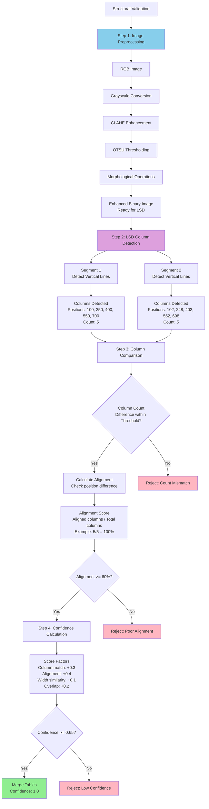
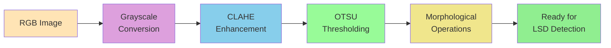

# Split Table Merging

A comprehensive guide to Doctra's automatic detection and merging of tables split across page boundaries.

## Overview

Many documents contain large tables that span multiple pages. When processing such documents, each page may contain only a portion of a table, making it difficult to extract complete data. Doctra's split table merging feature automatically detects these split tables and combines them into single, complete table images.

## Table of Contents

- [How It Works](#how-it-works)
- [Process Overview: A Step-by-Step Narrative](#process-overview-a-step-by-step-narrative)
- [Detection Algorithm](#detection-algorithm)
- [Visual Schema](#visual-schema)
- [Phase-by-Phase Breakdown](#phase-by-phase-breakdown)
- [Configuration Parameters](#configuration-parameters)
- [Examples](#examples)
- [Troubleshooting](#troubleshooting)

## How It Works

The split table detection uses a sophisticated two-phase approach:

1. **Phase 1: Proximity Detection** - Fast spatial heuristics to identify candidate pairs
2. **Phase 2: Structural Validation** - Deep structural analysis using computer vision

This design balances speed (avoiding expensive operations on all pairs) with accuracy (validating only promising candidates).

## Process Overview: A Step-by-Step Narrative

To help you understand how split table merging works, here's a walkthrough of what happens when Doctra processes a document with split tables:

### The Initial Situation

Imagine you have a financial report with a large table that spans two pages. On page 1, the table starts at row 1 and continues until row 15, but runs out of space near the bottom. On page 2, the table resumes at row 16 and continues with the remaining data. To a human reader, this is clearly one continuous table, but to a document parser, these appear as two separate table images.

### Phase 1: Finding Potential Matches (Proximity Detection)

When Doctra begins processing your document, it first identifies all tables on every page. Let's say it finds 8 tables total across 5 pages. Now, instead of performing expensive computer vision analysis on all 64 possible pairs (8×8), Doctra uses smart heuristics to quickly filter potential matches.

**The Position Check**: Doctra looks for tables that are positioned at page boundaries. A table on page 1 that's very close to the bottom (say, within 20% of the page height from the bottom) is a strong candidate for being the first part of a split table. Similarly, a table on page 2 that's very close to the top (within 15% from the top) could be the continuation. If both conditions are met, this pair moves to the next check.

**The Overlap Check**: Even if two tables are at page boundaries, they might be completely different tables. Doctra checks if they overlap horizontally. If two tables have at least 50% horizontal overlap, it suggests they're aligned and could be the same table. Think of it like two puzzle pieces - if they don't overlap at all, they probably don't belong together.

**The Gap Analysis**: Pages have headers, footers, and margins that create gaps between content. Doctra calculates the total gap between the end of the first table and the start of the second table, accounting for the page break. If this gap is reasonable (typically within 25% of the page height), it indicates the tables were separated by a normal page break rather than being intentionally placed far apart.

**The Width Check**: Finally, Doctra verifies that both table segments have similar widths. A table that's 800 pixels wide on page 1 shouldn't suddenly become 500 pixels wide on page 2 - that would indicate a different table structure. Similar widths suggest structural continuity.

If all four checks pass, Doctra has found a promising candidate pair and proceeds to deeper analysis. This filtering is crucial - it means Doctra only spends computational resources on pairs that are likely matches, keeping the process fast.

### Phase 2: Verifying the Match (Structural Validation)

For pairs that pass Phase 1, Doctra performs a more detailed analysis using computer vision to confirm they're truly parts of the same table.

**Image Preprocessing**: Before analyzing structure, Doctra enhances the table images. It converts them to grayscale, improves contrast using CLAHE (Contrast Limited Adaptive Histogram Equalization), converts to binary (black and white), and applies morphological operations to connect broken or dashed lines. This prepares the images for accurate line detection.

**Column Detection**: Using OpenCV's Line Segment Detector (LSD), Doctra identifies all vertical lines in each table segment. These vertical lines represent column boundaries. The algorithm detects line segments, filters for near-vertical lines (75° to 105°), extracts their x-coordinates, clusters nearby coordinates together (since multiple small line segments might represent one column), and finally removes columns too close to the edges (which are often just page borders).

**Column Comparison**: Now Doctra compares the detected columns between the two segments. First, it checks if the column counts are similar - if one segment has 5 columns and the other has 8, they're probably different tables. However, Doctra uses adaptive tolerance - for larger tables (more columns), it allows slightly more variation since column detection can be less precise on complex tables.

**Alignment Validation**: Even if the column counts match, the columns need to align between segments. Doctra pairs each column from segment 1 with the closest column in segment 2 and measures the distance. If at least 60% of columns align within a small tolerance (default 10 pixels), it indicates the same table structure continues across pages.

**Confidence Scoring**: Based on all these factors, Doctra calculates a confidence score between 0 and 1:
- Column count match contributes up to 0.3 points
- Column alignment contributes up to 0.4 points  
- Width similarity contributes up to 0.1 points
- Horizontal overlap contributes up to 0.2 points

If the final confidence score meets the minimum threshold (default 0.65), Doctra confirms this is a split table and proceeds to merge.

### The Merging Process

Once a match is confirmed, Doctra creates a composite image by stacking the two table segments vertically. The merged image is then treated as a single table for the rest of the processing pipeline. If you have VLM (Vision Language Model) enabled, Doctra extracts structured data from the complete merged table rather than from fragmented pieces.

### Fallback Mechanisms

Sometimes, tables don't have clear column boundaries (borderless tables) or column detection fails due to image quality. Doctra has fallback mechanisms:
- If too many columns are detected (likely noise), it falls back to proximity-based matching with lower confidence
- If no columns are detected in either segment, it relies solely on Phase 1 checks with moderate confidence

This ensures that even tables without clear borders can be merged if they meet the proximity criteria.

### The Final Result

In your financial report example, Doctra would detect that the table on page 1 (rows 1-15) and page 2 (rows 16+) are parts of the same table. It would merge them into a single image containing all rows, and this complete table would appear in your output markdown, HTML, or Excel files as one continuous table rather than two fragments. The merged table is labeled with the page range (e.g., "pages 1-2") and includes the confidence score so you can verify the quality of the merge.

This two-phase approach ensures that Doctra can accurately merge split tables while remaining efficient enough for production use, processing large documents with many tables in reasonable time.

## Detection Algorithm

### High-Level Flow

```mermaid
flowchart TD
    A[Start: Parse PDF Document] --> B[Extract Tables from All Pages]
    B --> C{Phase 1: Proximity Detection}
    
    C --> D[1. Check Position<br/>bottom/top thresholds]
    D --> E[2. Check Horizontal Overlap<br/>≥50% required]
    E --> F[3. Check Gap Between Tables<br/>≤25% of page height]
    F --> G[4. Check Width Similarity<br/>≤20% difference]
    
    G --> H{All Checks Pass?}
    H -->|Yes| I[Phase 2: Structural Validation]
    H -->|No| J[Skip Pair<br/>Try Next]
    
    I --> K[1. Detect Columns using LSD]
    K --> L[2. Compare Column Counts<br/>Adaptive tolerance]
    L --> M[3. Check Column Alignment<br/>≥60% must align]
    M --> N[4. Calculate Confidence Score]
    
    N --> O{Confidence ≥ 0.65?}
    O -->|Yes| P[✅ Merge Tables]
    O -->|No| Q[❌ Reject Match]
    
    J --> R[Continue with Next Pair]
    Q --> R
    P --> S[Create Merged Image]
    
    style P fill:#90EE90
    style Q fill:#FFB6C1
    style I fill:#87CEEB
    style C fill:#DDA0DD
```



## Visual Schema

### Document Layout Representation

```mermaid
graph LR
    subgraph Page1["📄 Page 1"]
        direction TB
        P1_Content[Document Content]
        P1_Table["📊 Table Segment 1<br/>Row 1<br/>Row 2<br/>Row 3<br/>Row 4<br/>Row 5<br/><br/>📍 Close to bottom<br/>(≥80% of page)"]
        P1_Content --> P1_Table
    end
    
    subgraph Gap["🔄 Gap: 18.8%<br/>(Page break +<br/>headers/footers)"]
        G[Gap]
    end
    
    subgraph Page2["📄 Page 2"]
        direction TB
        P2_Table["📊 Table Segment 2<br/>📍 Close to top<br/>(≤15% from top)<br/><br/>Row 6<br/>Row 7<br/>Row 8<br/>..."]
        P2_Content[Document Content]
        P2_Table --> P2_Content
    end
    
    P1_Table --> Gap
    Gap --> P2_Table
    
    style P1_Table fill:#FFE4B5
    style P2_Table fill:#FFE4B5
    style Gap fill:#F0F0F0
```



### Phase 1: Proximity Detection Schema

```mermaid
flowchart TD
    Start[Proximity Detection] --> Check1[Check 1: Position]
    
    Check1 --> C1A["📍 Segment 1<br/>y2 ≥ 80% of page<br/>(Close to bottom)"]
    Check1 --> C1B["📍 Segment 2<br/>y1 ≤ 15% of page<br/>(Close to top)"]
    C1A --> C1Result{Position OK?}
    C1B --> C1Result
    
    C1Result -->|Yes| Check2[Check 2: Horizontal Overlap]
    C1Result -->|No| Fail1[❌ Reject]
    
    Check2 --> C2Calc["Calculate Overlap<br/>Overlap = min(x2_1, x2_2) - max(x1_1, x1_2)<br/>Ratio = Overlap / max(width1, width2)"]
    C2Calc --> C2Result{Overlap ≥ 50%?}
    
    C2Result -->|Yes| Check3[Check 3: Gap Analysis]
    C2Result -->|No| Fail2[❌ Reject]
    
    Check3 --> C3Calc["Gap = (Page1_height - Seg1_y2) + Seg2_y1<br/>Gap Ratio = Gap / Page Height"]
    C3Calc --> C3Result{Gap ≤ 25%?}
    
    C3Result -->|Yes| Check4[Check 4: Width Similarity]
    C3Result -->|No| Fail3[❌ Reject]
    
    Check4 --> C4Calc["Width Diff = |width1 - width2|<br/>Ratio = Diff / max(width1, width2)"]
    C4Calc --> C4Result{Width Diff ≤ 20%?}
    
    C4Result -->|Yes| Pass[✅ All Checks Pass<br/>Proceed to Phase 2]
    C4Result -->|No| Fail4[❌ Reject]
    
    style Pass fill:#90EE90
    style Fail1 fill:#FFB6C1
    style Fail2 fill:#FFB6C1
    style Fail3 fill:#FFB6C1
    style Fail4 fill:#FFB6C1
    style Check1 fill:#FFE4B5
    style Check2 fill:#FFE4B5
    style Check3 fill:#FFE4B5
    style Check4 fill:#FFE4B5
```



### Phase 2: Structural Validation Schema



## Phase-by-Phase Breakdown

### Phase 1: Proximity Detection

#### 1.1 Position Check

**Purpose**: Identify tables that are positioned at page boundaries, which is a strong indicator of page breaks.

**Algorithm**:
```
For table segment 1 on page N:
  bottom_ratio = segment_y2 / page_height
  If bottom_ratio >= (1.0 - bottom_threshold_ratio):
    ✅ Candidate for first segment

For table segment 2 on page N+1:
  top_ratio = segment_y1 / page_height
  If top_ratio <= top_threshold_ratio:
    ✅ Candidate for second segment
```

**Example**:
```
Page Height: 1000px
Segment 1 y2: 850px
  → bottom_ratio = 850/1000 = 0.85
  → Threshold: 1.0 - 0.20 = 0.80
  → 0.85 >= 0.80 ✅ PASS

Segment 2 y1: 150px
  → top_ratio = 150/1000 = 0.15
  → Threshold: 0.15
  → 0.15 <= 0.15 ✅ PASS
```

#### 1.2 Horizontal Overlap Check

**Purpose**: Ensure tables are aligned horizontally, indicating they're the same table.

**Algorithm**:
```
overlap = calculate_overlap(seg1_x1, seg1_x2, seg2_x1, seg2_x2)
  = max(0, min(seg1_x2, seg2_x2) - max(seg1_x1, seg2_x1))

overlap_ratio = overlap / max(seg1_width, seg2_width)

If overlap_ratio >= 0.5:
  ✅ PASS (at least 50% overlap)
```

**Visual Representation**:

```mermaid
graph LR
    subgraph Seg1["Segment 1"]
        S1[Table Width<br/>11 units]
    end
    
    subgraph Seg2["Segment 2"]
        S2[Table Width<br/>11 units]
    end
    
    subgraph Overlap["Overlap Zone"]
        OV["Overlap: 7 units<br/>Ratio: 63.6% ✅"]
    end
    
    S1 -.->|Overlap| OV
    S2 -.->|Overlap| OV
    
    style Overlap fill:#90EE90
    style Seg1 fill:#FFE4B5
    style Seg2 fill:#FFE4B5
```



#### 1.3 Gap Analysis

**Purpose**: Measure the space between tables accounting for page breaks, headers, and footers.

**Algorithm**:
```
gap_pixels = (page1_height - seg1_y2) + seg2_y1
gap_ratio = gap_pixels / page1_height

If gap_ratio <= max_gap_ratio:
  ✅ PASS (gap is reasonable)
```

**Considerations**:
- Headers/footers take up space
- Page margins create natural gaps
- Default 25% accommodates typical document layouts

#### 1.4 Width Similarity Check

**Purpose**: Verify both segments have similar widths, confirming they share the same structure.

**Algorithm**:
```
width1 = seg1_x2 - seg1_x1
width2 = seg2_x2 - seg2_x1
width_diff = abs(width1 - width2)
width_ratio = width_diff / max(width1, width2)

If width_ratio <= width_similarity_threshold (0.20):
  ✅ PASS (widths are similar)
```

### Phase 2: Structural Validation

#### 2.1 Image Preprocessing

**Purpose**: Enhance images for optimal line detection.

**Steps**:

1. **Grayscale Conversion**
   ```
   Original RGB → Grayscale
   ```

2. **Contrast Enhancement (CLAHE)**
   ```
   Apply Contrast Limited Adaptive Histogram Equalization
   → Improves line visibility in low-contrast areas
   ```

3. **Binary Thresholding (OTSU)**
   ```
   Grayscale → Binary (black/white)
   → OTSU automatically determines optimal threshold
   ```

4. **Morphological Operations**
   ```
   Apply MORPH_CLOSE with vertical kernel (1x5)
   → Connects broken or dashed lines
   → Enhances vertical line detection
   ```

**Visual Flow**:



#### 2.2 LSD Column Detection

**Purpose**: Detect vertical lines representing column boundaries using OpenCV's Line Segment Detector.

**LSD Algorithm Overview**:
```
1. Gradient Computation
   → Calculate image gradients
   → Identify edge regions

2. Line Region Growing
   → Grow line segments from seed points
   → Connect adjacent pixels with similar orientation

3. Region Validation
   → Verify regions meet line criteria
   → Filter by length and support

4. Refinement
   → Refine line endpoints
   → Adjust for sub-pixel accuracy
```

**Column Extraction Process**:

```mermaid
flowchart TD
    Step1["Step 1: Detect Line Segments<br/>LSD Algorithm<br/>Returns: List of (x1,y1,x2,y2)"] --> Step2
    
    Step2["Step 2: Filter by Angle<br/>Keep: 75° to 105°<br/>Remove: horizontal/diagonal lines"] --> Step3
    
    Step3["Step 3: Extract X-Coordinates<br/>Collect: x1, x2 for each line<br/>Result: [x1, x2, x3, ..., xn]"] --> Step4
    
    Step4["Step 4: Cluster Nearby Coordinates<br/>Threshold: 1% of image width<br/>Merge: |x_i - x_j| < threshold<br/>Result: [col1, col2, col3, ...]"] --> Step5
    
    Step5["Step 5: Filter Edge Columns<br/>Remove: within 2% of edges<br/>Result: Valid column positions"]
    
    style Step1 fill:#FFE4B5
    style Step2 fill:#DDA0DD
    style Step3 fill:#87CEEB
    style Step4 fill:#98FB98
    style Step5 fill:#90EE90
```



**Clustering Example**:
```
Detected x-coordinates:
[98, 100, 102, 248, 250, 252, 398, 400, 402]

After clustering (threshold=5px):
[100, 250, 400]  ← 3 columns detected
```

#### 2.3 Column Count Matching

**Purpose**: Compare the number of columns in both segments with adaptive tolerance.

**Algorithm**:
```
col_count1 = len(columns_detected_in_seg1)
col_count2 = len(columns_detected_in_seg2)
diff = abs(col_count1 - col_count2)

# Adaptive threshold based on table size
max_cols = max(col_count1, col_count2)

If max_cols <= 5:
    max_allowed_diff = 1
Else if max_cols <= 10:
    max_allowed_diff = 2
Else if max_cols <= 20:
    max_allowed_diff = max(3, int(max_cols * 0.15))
Else:
    max_allowed_diff = max(5, int(max_cols * 0.20))

If diff <= max_allowed_diff:
    ✅ PASS
```

**Examples**:
```
Small table: 4 vs 5 columns → diff=1 → ✅ (threshold=1)
Medium: 8 vs 10 → diff=2 → ✅ (threshold=2)
Large: 15 vs 18 → diff=3 → ✅ (threshold=3, 15*0.15=2.25→3)
```

#### 2.4 Column Alignment Validation

**Purpose**: Verify columns align between segments, ensuring structural continuity.

**Algorithm**:
```
For each column in segment1:
    Find closest column in segment2
    Calculate distance = |col1_pos - col2_pos|
    If distance <= tolerance:
        ✅ Aligned column
    Else:
        ❌ Misaligned column

alignment_score = aligned_columns / total_columns

If alignment_score >= 0.6:
    ✅ PASS (at least 60% alignment)
```

**Visual Example**:

```mermaid
graph TB
    subgraph Seg1["Segment 1 Columns"]
        C1A[Column 1: 100px]
        C2A[Column 2: 250px]
        C3A[Column 3: 400px]
        C4A[Column 4: 550px]
        C5A[Column 5: 700px]
    end
    
    subgraph Seg2["Segment 2 Columns"]
        C1B[Column 1: 102px]
        C2B[Column 2: 248px]
        C3B[Column 3: 402px]
        C4B[Column 4: 552px]
        C5B[Column 5: 698px]
    end
    
    subgraph Alignment["Alignment Check"]
        A1["Diff: 2px ✅"]
        A2["Diff: 2px ✅"]
        A3["Diff: 2px ✅"]
        A4["Diff: 2px ✅"]
        A5["Diff: 2px ✅"]
        AScore["Score: 5/5 = 100% ✅"]
    end
    
    C1A --> A1
    C1B --> A1
    C2A --> A2
    C2B --> A2
    C3A --> A3
    C3B --> A3
    C4A --> A4
    C4B --> A4
    C5A --> A5
    C5B --> A5
    
    A1 --> AScore
    A2 --> AScore
    A3 --> AScore
    A4 --> AScore
    A5 --> AScore
    
    style Alignment fill:#90EE90
    style Seg1 fill:#FFE4B5
    style Seg2 fill:#FFE4B5
    style AScore fill:#90EE90
```



#### 2.5 Confidence Calculation

**Purpose**: Compute overall confidence score for the merge decision.

**Scoring Formula**:
```
confidence = 0.0

# Column count match (max 0.3)
if column_count_match:
    confidence += 0.3
elif column_diff <= 1:
    confidence += 0.2
elif column_diff <= 2:
    confidence += 0.1

# Column alignment (max 0.4)
alignment_weight = alignment_score * 0.4
confidence += alignment_weight

# Width similarity (max 0.1)
width_score = 1.0 - min(1.0, width_ratio / 0.2)
confidence += width_score * 0.1

# Overlap ratio (max 0.2)
overlap_score = min(1.0, (overlap_ratio - 0.5) / 0.5)  # 0.5-1.0 → 0.0-1.0
confidence += overlap_score * 0.2

Final: confidence (0.0 - 1.0)
```

**Example Calculation**:
```
Perfect match:
  - Column count: 5 vs 5 → +0.3
  - Alignment: 100% → +0.4
  - Width: 800px vs 802px (0.25%) → +0.1
  - Overlap: 98% → +0.2
  Total: 1.0 (100% confidence) ✅
```

### Fallback Mechanisms

#### Too Many Columns Detected

**Problem**: LSD may detect noise (horizontal lines, text boundaries) as columns.

**Solution**:
```
If detected_columns > 20:
    → Likely noise, not real columns
    → Skip structural validation
    → Use proximity-based fallback
    → Confidence: 0.70 (lower than validated)
```

#### No Columns Detected

**Problem**: Borderless tables or poor image quality prevent column detection.

**Solution**:
```
If columns_detected == 0 in both segments:
    → Tables lack visible borders
    → Fall back to proximity matching
    → Confidence: 0.65
    → Reason: "Proximity match (no columns detected by LSD)"
```

## Configuration Parameters

### Detailed Parameter Reference

| Parameter | Type | Default | Range | Impact |
|-----------|------|---------|-------|--------|
| `merge_split_tables` | bool | `False` | True/False | Master switch for feature |
| `bottom_threshold_ratio` | float | `0.20` | 0.0-1.0 | How close to bottom triggers detection |
| `top_threshold_ratio` | float | `0.15` | 0.0-1.0 | How close to top triggers detection |
| `max_gap_ratio` | float | `0.25` | 0.0-1.0 | Maximum gap between segments |
| `column_alignment_tolerance` | float | `10.0` | 1.0-50.0 | Pixel tolerance for alignment |
| `min_merge_confidence` | float | `0.65` | 0.0-1.0 | Minimum confidence to merge |

### Tuning Guidelines

#### For Documents with Large Headers/Footers

```python
parser = StructuredPDFParser(
    merge_split_tables=True,
    max_gap_ratio=0.30,  # Increase to 30% for larger headers
)
```

#### For Stricter Merging (Fewer False Positives)

```python
parser = StructuredPDFParser(
    merge_split_tables=True,
    min_merge_confidence=0.80,  # Higher threshold
    column_alignment_tolerance=5.0,  # Tighter alignment
)
```

#### For More Aggressive Merging (Catch More Cases)

```python
parser = StructuredPDFParser(
    merge_split_tables=True,
    min_merge_confidence=0.55,  # Lower threshold
    max_gap_ratio=0.35,  # Allow larger gaps
    bottom_threshold_ratio=0.25,  # More lenient position check
    top_threshold_ratio=0.20,
)
```

## Examples

### Example 1: Financial Report Table

```
Document: Quarterly Financial Report
Pages: 2 pages, table spans both

Detection Result:
✅ Match found: Page 1→2
   Confidence: 0.92
   Reason: LSD validation: 6 vs 6 columns, alignment=0.95
   Gap: 18.8% of page height
   
Output:
- Merged image: merged_table_1_2.png
- Markdown: Single table entry with note "pages 1-2"
```

### Example 2: Borderless Table

```
Document: Research Data Table
Pages: 2 pages, no visible borders

Detection Result:
✅ Match found: Page 3→4
   Confidence: 0.70
   Reason: Proximity match (too many columns detected, likely noise)
   Note: Using fallback validation (no clear column boundaries)
   
Output:
- Merged image created
- Lower confidence due to lack of structural validation
```

### Example 3: Rejected Match

```
Document: Separate Tables
Pages: 2 pages with different tables

Detection Result:
❌ No match
   Reason: Column count mismatch (4 vs 7 columns)
   Confidence: 0.45 (below threshold of 0.65)
   
Output:
- Tables processed separately
- No merge attempted
```

## Troubleshooting

### Tables Not Being Merged

**Problem**: Split tables are not being detected.

**Solutions**:

1. **Check Position Thresholds**
   ```python
   # Verify tables are actually near page boundaries
   bottom_threshold_ratio=0.25  # Try increasing
   top_threshold_ratio=0.20
   ```

2. **Check Gap Tolerance**
   ```python
   # Large headers/footers may require:
   max_gap_ratio=0.30  # Increase from 0.25
   ```

3. **Lower Confidence Threshold**
   ```python
   min_merge_confidence=0.60  # Try lowering from 0.65
   ```

4. **Enable Debug Mode**
   ```python
   import logging
   logging.basicConfig(level=logging.DEBUG)
   ```

### False Positives (Incorrect Merges)

**Problem**: Separate tables are being incorrectly merged.

**Solutions**:

1. **Increase Confidence Threshold**
   ```python
   min_merge_confidence=0.75  # More conservative
   ```

2. **Tighten Alignment Tolerance**
   ```python
   column_alignment_tolerance=5.0  # Stricter alignment
   ```

3. **Adjust Position Thresholds**
   ```python
   bottom_threshold_ratio=0.15  # More restrictive
   top_threshold_ratio=0.10
   ```

### Performance Issues

**Problem**: Processing is too slow with split table detection.

**Solutions**:

1. **Disable if not needed**
   ```python
   merge_split_tables=False  # Skip detection entirely
   ```

2. **The feature is already optimized** - Phase 1 filters out most pairs before expensive Phase 2 operations

### Column Detection Failures

**Problem**: LSD not detecting columns correctly.

**Causes & Solutions**:

1. **Low image quality**
   - Solution: Increase DPI
   ```python
   dpi=300  # Instead of 200
   ```

2. **Dashed/broken lines**
   - Solution: Already handled by morphological operations
   - May need to check preprocessing parameters

3. **Borderless tables**
   - Solution: System automatically falls back to proximity matching

## Technical Implementation Details

### Data Structures

```python
@dataclass
class TableSegment:
    """Represents a table segment with bounding box and page info."""
    page_index: int
    box_index: int
    x1: float
    y1: float
    x2: float
    y2: float
    page_width: int
    page_height: int
    image: Image.Image  # Cropped table image
    confidence: float

@dataclass
class SplitTableMatch:
    """Represents a validated split table match."""
    segment1: TableSegment
    segment2: TableSegment
    confidence: float
    merge_reason: str
    column_count1: int
    column_count2: int
```

### Performance Characteristics

- **Time Complexity**: O(n²) for table pairs, but Phase 1 filters dramatically reduce n
- **Space Complexity**: O(n) for storing segments and matches
- **Typical Performance**: 
  - 10 pages with 20 tables → ~10ms for Phase 1, ~50ms for Phase 2
  - Most time spent in image processing (LSD detection)

### Dependencies

- **OpenCV**: For LSD (Line Segment Detector) and image processing
- **NumPy**: For numerical operations
- **PIL**: For image manipulation

## Best Practices

1. **Enable for financial/structured documents**: Most likely to have split tables
2. **Disable for narrative documents**: Tables are usually separate
3. **Adjust thresholds based on document type**: Financial reports may need different settings than academic papers
4. **Review merged results**: Especially when using lower confidence thresholds
5. **Use appropriate DPI**: Higher DPI improves column detection accuracy

## Related Documentation

- [Structured Parser Guide](../parsers/structured-parser.md) - Main parser documentation
- [API Reference](../../api/parsers.md) - Complete parameter reference
- [Examples](../../examples/basic-usage.md) - Code examples and use cases
