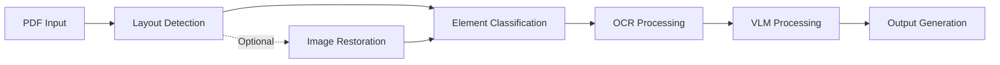

# Core Concepts

Understanding Doctra's core concepts will help you use the library effectively.

## Document Processing Pipeline

Doctra follows a multi-stage pipeline for document processing:



### Pipeline Stages

1. **Layout Detection**: Analyzes document structure using PaddleOCR
2. **Element Classification**: Identifies text, tables, charts, and figures
3. **OCR Processing**: Extracts text from identified regions
4. **VLM Processing** (Optional): Converts visual elements to structured data
5. **Output Generation**: Creates Markdown, Excel, HTML, and JSON files

## Architecture Overview

Doctra is organized into several key components:

### Parsers

Parsers are the main entry point for document processing. They orchestrate the entire pipeline.

**StructuredPDFParser**
:   The base parser for general PDF processing. Handles layout detection, OCR, and output generation.

**EnhancedPDFParser**
:   Extends StructuredPDFParser with image restoration capabilities for low-quality documents.

**ChartTablePDFParser**
:   Specialized parser focused on extracting only charts and tables.

### Engines

Engines provide specific processing capabilities:

**Layout Detection**
:   PaddleOCR-based layout analysis to identify document structure.

**OCR Engine**
:   Tesseract-based text extraction from images.

**DocRes Engine**
:   Image restoration for document enhancement.

**VLM Service**
:   Vision Language Model integration for structured data extraction.

### Exporters

Exporters handle output generation in various formats:

- **MarkdownWriter**: Creates human-readable Markdown files
- **ExcelWriter**: Generates spreadsheets with structured data
- **HTMLWriter**: Produces web-ready HTML documents
- **ImageSaver**: Saves cropped visual elements

## Element Types

Doctra classifies document elements into four main types:

### Text Elements

Regular text content including:

- Paragraphs
- Headings
- Lists
- Captions

**Processing**: OCR → Text extraction → Markdown formatting

### Tables

Tabular data with rows and columns.

**Processing Options**:

1. **Without VLM**: Saved as images only
2. **With VLM**: Converted to Excel/HTML + saved as images

**Output**: `tables.xlsx`, `tables.html`, cropped images

### Charts

Visual representations of data including:

- Bar charts
- Line graphs
- Pie charts
- Scatter plots

**Processing Options**:

1. **Without VLM**: Saved as images with captions
2. **With VLM**: Data extracted + description generated

**Output**: Cropped images, optional structured data

### Figures

General images and diagrams including:

- Photographs
- Illustrations
- Diagrams
- Logos

**Processing**: Cropped and saved as images with context

## Layout Detection

Layout detection is the foundation of Doctra's processing.

### How It Works

1. **Page Rendering**: PDF pages rendered to images at specified DPI
2. **Model Inference**: PaddleOCR layout model identifies regions
3. **Bounding Boxes**: Each element gets coordinates and confidence score
4. **Classification**: Elements labeled as text/table/chart/figure

### Detection Parameters

```python
parser = StructuredPDFParser(
    layout_model_name="PP-DocLayout_plus-L",  # Model choice
    dpi=200,  # Image resolution
    min_score=0.5  # Confidence threshold
)
```

**layout_model_name**
:   PaddleOCR model to use. Options: `PP-DocLayout_plus-L` (best), `PP-DocLayout_plus-M` (faster)

**dpi**
:   Image resolution. Higher = better quality but slower. Range: 100-300

**min_score**
:   Minimum confidence score (0-1). Higher = fewer false positives

### Visualization

Verify layout detection quality:

```python
parser.display_pages_with_boxes(
    pdf_path="document.pdf",
    num_pages=3
)
```

This shows bounding boxes with colors:

- 🔵 Blue: Text
- 🔴 Red: Tables
- 🟢 Green: Charts
- 🟠 Orange: Figures

## OCR Processing

OCR (Optical Character Recognition) extracts text from images. Doctra supports two OCR engines:

### OCR Engines

**PyTesseract** (default)
:   Traditional Tesseract OCR with extensive language support and fine-grained control.

**PaddleOCR**
:   Advanced PP-OCRv5_server model (PaddleOCR 3.0) with superior accuracy and GPU acceleration.

### Configuration

Doctra uses a **dependency injection pattern** for OCR engines. You initialize the OCR engine externally and pass it to the parser.

**Using PyTesseract (default):**

```python
from doctra import StructuredPDFParser
from doctra.engines.ocr import PytesseractOCREngine

# Option 1: Use default (automatic)
parser = StructuredPDFParser()  # Creates default PytesseractOCREngine

# Option 2: Explicitly configure
tesseract_ocr = PytesseractOCREngine(
    lang="eng",  # Language
    psm=6,       # Page segmentation mode
    oem=3        # OCR Engine mode
)
parser = StructuredPDFParser(ocr_engine=tesseract_ocr)
```

**Using PaddleOCR:**

```python
from doctra import StructuredPDFParser
from doctra.engines.ocr import PaddleOCREngine

paddle_ocr = PaddleOCREngine(
    device="gpu",  # Use "cpu" if no GPU available
    use_doc_orientation_classify=False,
    use_doc_unwarping=False,
    use_textline_orientation=False
)
parser = StructuredPDFParser(ocr_engine=paddle_ocr)
```

### PyTesseract Parameters

Configure these when initializing `PytesseractOCREngine`:

**lang**
:   Tesseract language code. Examples: `eng`, `fra`, `spa`, `deu`

**psm**
:   Page segmentation mode. Common values:
    
    - `3`: Automatic page segmentation
    - `4`: Single column of text (default)
    - `6`: Uniform block of text
    - `11`: Sparse text
    - `12`: Sparse text with OSD

**oem**
:   OCR Engine mode:
    
    - `0`: Legacy engine
    - `1`: Neural nets LSTM
    - `3`: Default (both)

### PaddleOCR Parameters

Configure these when initializing `PaddleOCREngine`:

**device**
:   Processing device: `"gpu"` (default, recommended) or `"cpu"`

**use_doc_orientation_classify**
:   Enable automatic document orientation detection (default: `False`)

**use_doc_unwarping**
:   Enable perspective correction for scanned documents (default: `False`)

**use_textline_orientation**
:   Enable text line orientation classification (default: `False`)

### Improving OCR Accuracy

1. **Choose PaddleOCR for complex documents**: Better accuracy on degraded or complex documents
   ```python
   from doctra import StructuredPDFParser
   from doctra.engines.ocr import PaddleOCREngine
   
   paddle_ocr = PaddleOCREngine(device="gpu")
   parser = StructuredPDFParser(ocr_engine=paddle_ocr)
   ```

2. **Increase DPI**: Higher resolution = better text recognition
   ```python
   parser = StructuredPDFParser(dpi=300)
   ```

3. **Use Image Restoration**: Enhance document quality first
   ```python
   from doctra import EnhancedPDFParser
   from doctra.engines.ocr import PaddleOCREngine
   
   paddle_ocr = PaddleOCREngine(device="gpu")
   parser = EnhancedPDFParser(
       use_image_restoration=True,
       ocr_engine=paddle_ocr  # Combine for best results
   )
   ```

4. **Correct Language** (PyTesseract): Specify document language when initializing engine
   ```python
   from doctra import StructuredPDFParser
   from doctra.engines.ocr import PytesseractOCREngine
   
   tesseract_ocr = PytesseractOCREngine(lang="fra")  # French
   parser = StructuredPDFParser(ocr_engine=tesseract_ocr)
   ```

## Image Restoration

Image restoration improves document quality before processing.

### Restoration Tasks

| Task | Purpose | When to Use |
|------|---------|-------------|
| `appearance` | General enhancement | Most documents (default) |
| `dewarping` | Fix perspective | Scanned with distortion |
| `deshadowing` | Remove shadows | Poor lighting |
| `deblurring` | Reduce blur | Motion blur, focus issues |
| `binarization` | B&W conversion | Clean text extraction |
| `end2end` | Full pipeline | Severely degraded |

### Usage

```python
from doctra import EnhancedPDFParser

parser = EnhancedPDFParser(
    use_image_restoration=True,
    restoration_task="appearance",
    restoration_device="cuda"  # or "cpu"
)
```

### Performance Impact

| Restoration | Processing Time | Quality Improvement |
|-------------|----------------|---------------------|
| None | Baseline | Baseline |
| CPU | +200% | +30-50% |
| GPU | +50% | +30-50% |

## VLM Integration

Vision Language Models convert visual elements to structured data.

### Supported Providers

- **OpenAI**: GPT-4 Vision, GPT-4o
- **Gemini**: Google's vision models
- **Anthropic**: Claude with vision
- **OpenRouter**: Access multiple models
- **Qianfan**: Baidu AI Cloud ERNIE models
- **Ollama**: Local models (no API key required)

### Configuration

```python
parser = StructuredPDFParser(
    use_vlm=True,
    vlm_provider="openai",
    vlm_api_key="your-api-key",
    vlm_model="gpt-4o"  # Optional, uses default if not specified
)
```

### What Gets Processed

With VLM enabled:

**Tables**
:   Converted to Excel/HTML with cell-by-cell data

**Charts**
:   Data extracted + description generated

**Figures**
:   Descriptions and context generated

### Cost Considerations

VLM processing requires API calls:

- **Per Document**: 1-10 API calls depending on visual elements
- **Per Element**: ~1 API call per table/chart
- **Cost**: Varies by provider (typically $0.01-$0.10 per document)

## Output Formats

Doctra generates multiple output formats simultaneously.

### Markdown (.md)

Human-readable document with:

- All text content
- Embedded images
- Table references
- Section structure

**Best for**: Documentation, reading, version control

### HTML (.html)

Web-ready document with:

- Styled content
- Interactive tables
- Image galleries
- Responsive layout

**Best for**: Web publishing, presentations

### Excel (.xlsx)

Spreadsheet with:

- One sheet per table
- Formatted cells
- Headers and data

**Best for**: Data analysis, further processing

### JSON (.json)

Structured data with:

- Element metadata
- Coordinates
- Content
- Relationships

**Best for**: Programmatic access, integration

## Best Practices

### Choosing the Right Parser

```python
# General documents
from doctra import StructuredPDFParser
parser = StructuredPDFParser()

# Scanned or low-quality documents
from doctra import EnhancedPDFParser
parser = EnhancedPDFParser(use_image_restoration=True)

# Only need charts/tables
from doctra import ChartTablePDFParser
parser = ChartTablePDFParser(extract_charts=True, extract_tables=True)
```

### Optimizing Performance

1. **Use appropriate DPI**: Higher isn't always better
   ```python
   # Good quality documents
   parser = StructuredPDFParser(dpi=150)
   
   # Low quality documents
   parser = StructuredPDFParser(dpi=250)
   ```

2. **Enable GPU when available**:
   ```python
   parser = EnhancedPDFParser(restoration_device="cuda")
   ```

3. **Batch processing**: Reuse parser instances
   ```python
   parser = StructuredPDFParser()
   for pdf in pdf_files:
       parser.parse(pdf)
   ```

### Managing Costs

When using VLM:

1. **Test without VLM first**: Ensure layout detection works
2. **Process selectively**: Use ChartTablePDFParser for specific elements
3. **Use cheaper models**: Consider Gemini for cost savings

## Next Steps

- [Structured Parser](parsers/structured-parser.md) - Learn about the base parser
- [Enhanced Parser](parsers/enhanced-parser.md) - Document restoration
- [VLM Integration](engines/vlm-integration.md) - Structured data extraction
- [Examples](../examples/basic-usage.md) - See it in action

