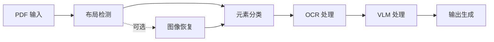

# 核心概念

理解 Doctra 的核心概念将帮助您有效地使用该库。

## 文档处理管道

Doctra 遵循多阶段管道进行文档处理：



### 管道阶段

1. **布局检测**：使用 PaddleOCR 分析文档结构
2. **元素分类**：识别文本、表格、图表和图形
3. **OCR 处理**：从识别的区域中提取文本
4. **VLM 处理**（可选）：将视觉元素转换为结构化数据
5. **输出生成**：创建 Markdown、Excel、HTML 和 JSON 文件

## 架构概述

Doctra 组织为几个关键组件：

### 解析器

解析器是文档处理的主要入口点。它们协调整个管道。

**StructuredPDFParser**
:   用于通用 PDF 处理的基础解析器。处理布局检测、OCR 和输出生成。

**EnhancedPDFParser**
:   扩展 StructuredPDFParser，具有图像恢复功能，适用于低质量文档。

**ChartTablePDFParser**
:   专门用于仅提取图表和表格的解析器。

**PaddleOCRVLPDFParser**
:   使用 PaddleOCRVL 视觉语言模型的端到端文档解析器，用于全面的文档理解，包括图表识别和分割表格合并。

### 引擎

引擎提供特定的处理能力：

**布局检测**
:   基于 PaddleOCR 的布局分析，用于识别文档结构。

**OCR 引擎**
:   基于 Tesseract 的图像文本提取。

**DocRes 引擎**
:   用于文档增强的图像恢复。

**VLM 服务**
:   用于结构化数据提取的视觉语言模型集成。

### 导出器

导出器处理各种格式的输出生成：

- **MarkdownWriter**：创建人类可读的 Markdown 文件
- **ExcelWriter**：生成包含结构化数据的电子表格
- **HTMLWriter**：生成 Web 就绪的 HTML 文档
- **ImageSaver**：保存裁剪的视觉元素

## 元素类型

Doctra 将文档元素分为四种主要类型：

### 文本元素

常规文本内容，包括：

- 段落
- 标题
- 列表
- 标题说明

**处理**：OCR → 文本提取 → Markdown 格式化

### 表格

包含行和列的表格数据。

**处理选项**：

1. **不使用 VLM**：仅保存为图像
2. **使用 VLM**：转换为 Excel/HTML + 保存为图像

**输出**：`tables.xlsx`、`tables.html`、裁剪的图像

### 图表

数据的视觉表示，包括：

- 条形图
- 折线图
- 饼图
- 散点图

**处理选项**：

1. **不使用 VLM**：保存为带标题的图像
2. **使用 VLM**：提取数据 + 生成描述

**输出**：裁剪的图像、可选的结构化数据

### 图形

一般图像和图表，包括：

- 照片
- 插图
- 图表
- 徽标

**处理**：裁剪并保存为带上下文的图像

## 布局检测

布局检测是 Doctra 处理的基础。

### 工作原理

1. **页面渲染**：PDF 页面以指定的 DPI 渲染为图像
2. **模型推理**：PaddleOCR 布局模型识别区域
3. **边界框**：每个元素获得坐标和置信度分数
4. **分类**：元素标记为文本/表格/图表/图形

### 检测参数

```python
parser = StructuredPDFParser(
    layout_model_name="PP-DocLayout_plus-L",  # 模型选择
    dpi=200,  # 图像分辨率
    min_score=0.5  # 置信度阈值
)
```

**layout_model_name**
:   要使用的 PaddleOCR 模型。选项：`PP-DocLayout_plus-L`（最佳）、`PP-DocLayout_plus-M`（更快）

**dpi**
:   图像分辨率。越高 = 质量越好但速度越慢。范围：100-300

**min_score**
:   最小置信度分数（0-1）。越高 = 误报越少

### 可视化

验证布局检测质量：

```python
parser.display_pages_with_boxes(
    pdf_path="document.pdf",
    num_pages=3
)
```

这显示带颜色的边界框：

- 🔵 蓝色：文本
- 🔴 红色：表格
- 🟢 绿色：图表
- 🟠 橙色：图形

## OCR 处理

OCR（光学字符识别）从图像中提取文本。Doctra 支持两种 OCR 引擎：

### OCR 引擎

**PyTesseract**（默认）
:   传统的 Tesseract OCR，具有广泛的语言支持和细粒度控制。

**PaddleOCR**
:   高级 PP-OCRv5_server 模型（PaddleOCR 3.0），具有卓越的准确性和 GPU 加速。

### 配置

Doctra 对 OCR 引擎使用**依赖注入模式**。您在外部初始化 OCR 引擎并将其传递给解析器。

**使用 PyTesseract（默认）：**

```python
from doctra import StructuredPDFParser
from doctra.engines.ocr import PytesseractOCREngine

# 选项 1：使用默认（自动）
parser = StructuredPDFParser()  # 创建默认 PytesseractOCREngine

# 选项 2：显式配置
tesseract_ocr = PytesseractOCREngine(
    lang="eng",  # 语言
    psm=6,       # 页面分割模式
    oem=3        # OCR 引擎模式
)
parser = StructuredPDFParser(ocr_engine=tesseract_ocr)
```

**使用 PaddleOCR：**

```python
from doctra import StructuredPDFParser
from doctra.engines.ocr import PaddleOCREngine

paddle_ocr = PaddleOCREngine(
    device="gpu",  # 如果没有 GPU 可用，使用 "cpu"
    use_doc_orientation_classify=False,
    use_doc_unwarping=False,
    use_textline_orientation=False
)
parser = StructuredPDFParser(ocr_engine=paddle_ocr)
```

### PyTesseract 参数

在初始化 `PytesseractOCREngine` 时配置这些：

**lang**
:   Tesseract 语言代码。示例：`eng`、`fra`、`spa`、`deu`

**psm**
:   页面分割模式。常用值：
    
    - `3`：自动页面分割
    - `4`：单列文本（默认）
    - `6`：统一文本块
    - `11`：稀疏文本
    - `12`：带 OSD 的稀疏文本

**oem**
:   OCR 引擎模式：
    
    - `0`：传统引擎
    - `1`：神经网络 LSTM
    - `3`：默认（两者）

### PaddleOCR 参数

在初始化 `PaddleOCREngine` 时配置这些：

**device**
:   处理设备：`"gpu"`（默认，推荐）或 `"cpu"`

**use_doc_orientation_classify**
:   启用自动文档方向检测（默认：`False`）

**use_doc_unwarping**
:   启用扫描文档的透视校正（默认：`False`）

**use_textline_orientation**
:   启用文本行方向分类（默认：`False`）

### 提高 OCR 准确性

1. **为复杂文档选择 PaddleOCR**：在退化或复杂文档上准确性更好
   ```python
   from doctra import StructuredPDFParser
   from doctra.engines.ocr import PaddleOCREngine
   
   paddle_ocr = PaddleOCREngine(device="gpu")
   parser = StructuredPDFParser(ocr_engine=paddle_ocr)
   ```

2. **增加 DPI**：更高的分辨率 = 更好的文本识别
   ```python
   parser = StructuredPDFParser(dpi=300)
   ```

3. **使用图像恢复**：首先增强文档质量
   ```python
   from doctra import EnhancedPDFParser
   from doctra.engines.ocr import PaddleOCREngine
   
   paddle_ocr = PaddleOCREngine(device="gpu")
   parser = EnhancedPDFParser(
       use_image_restoration=True,
       ocr_engine=paddle_ocr  # 结合使用以获得最佳结果
   )
   ```

4. **正确语言**（PyTesseract）：在初始化引擎时指定文档语言
   ```python
   from doctra import StructuredPDFParser
   from doctra.engines.ocr import PytesseractOCREngine
   
   tesseract_ocr = PytesseractOCREngine(lang="fra")  # 法语
   parser = StructuredPDFParser(ocr_engine=tesseract_ocr)
   ```

## 图像恢复

图像恢复在处理前改善文档质量。

### 恢复任务

| 任务 | 目的 | 何时使用 |
|------|------|----------|
| `appearance` | 一般增强 | 大多数文档（默认） |
| `dewarping` | 修复透视 | 扫描时有失真 |
| `deshadowing` | 去除阴影 | 光照不良 |
| `deblurring` | 减少模糊 | 运动模糊、对焦问题 |
| `binarization` | 黑白转换 | 干净的文本提取 |
| `end2end` | 完整流程 | 严重退化 |

### 用法

```python
from doctra import EnhancedPDFParser

parser = EnhancedPDFParser(
    use_image_restoration=True,
    restoration_task="appearance",
    restoration_device="cuda"  # 或 "cpu"
)
```

### 性能影响

| 恢复 | 处理时间 | 质量改善 |
|------|----------|----------|
| 无 | 基线 | 基线 |
| CPU | +200% | +30-50% |
| GPU | +50% | +30-50% |

## VLM 集成

视觉语言模型将视觉元素转换为结构化数据。

### 支持的提供商

- **OpenAI**：GPT-4 Vision、GPT-4o
- **Gemini**：Google 的视觉模型
- **Anthropic**：带视觉的 Claude
- **OpenRouter**：访问多个模型
- **Qianfan**：百度 AI 云 ERNIE 模型
- **Ollama**：本地模型（不需要 API 密钥）

### 配置

Doctra 对 VLM 引擎使用**依赖注入模式**。您在外部初始化 VLM 引擎并将其传递给解析器。

```python
from doctra import StructuredPDFParser
from doctra.engines.vlm.service import VLMStructuredExtractor

# 初始化 VLM 引擎
vlm_engine = VLMStructuredExtractor(
    vlm_provider="openai",
    vlm_model="gpt-4o",  # 可选，如果为 None 则使用默认值
    api_key="your-api-key"
)

# 将 VLM 引擎传递给解析器
parser = StructuredPDFParser(vlm=vlm_engine)
```

### 处理内容

启用 VLM 后：

**表格**
:   转换为 Excel/HTML，包含逐单元格数据

**图表**
:   提取数据 + 生成描述

**图形**
:   生成描述和上下文

### 成本考虑

VLM 处理需要 API 调用：

- **每个文档**：根据视觉元素，1-10 次 API 调用
- **每个元素**：每个表格/图表约 1 次 API 调用
- **成本**：因提供商而异（通常每个文档 $0.01-$0.10）

## 输出格式

Doctra 同时生成多种输出格式。

### Markdown (.md)

人类可读的文档，包含：

- 所有文本内容
- 嵌入的图像
- 表格引用
- 章节结构

**最适合**：文档、阅读、版本控制

### HTML (.html)

Web 就绪的文档，包含：

- 样式化内容
- 交互式表格
- 图像库
- 响应式布局

**最适合**：Web 发布、演示

### Excel (.xlsx)

电子表格，包含：

- 每个表格一个工作表
- 格式化的单元格
- 标题和数据

**最适合**：数据分析、进一步处理

### JSON (.json)

结构化数据，包含：

- 元素元数据
- 坐标
- 内容
- 关系

**最适合**：程序化访问、集成

## 最佳实践

### 选择正确的解析器

```python
# 通用文档
from doctra import StructuredPDFParser
parser = StructuredPDFParser()

# 扫描或低质量文档
from doctra import EnhancedPDFParser
parser = EnhancedPDFParser(use_image_restoration=True)

# 只需要图表/表格
from doctra import ChartTablePDFParser
parser = ChartTablePDFParser(extract_charts=True, extract_tables=True)

# 包含图表和表格的复杂文档（端到端 VLM 解析）
from doctra import PaddleOCRVLPDFParser
parser = PaddleOCRVLPDFParser(
    use_image_restoration=True,
    use_chart_recognition=True,
    merge_split_tables=True
)
```

### 优化性能

1. **使用适当的 DPI**：更高并不总是更好
   ```python
   # 高质量文档
   parser = StructuredPDFParser(dpi=150)
   
   # 低质量文档
   parser = StructuredPDFParser(dpi=250)
   ```

2. **在可用时启用 GPU**：
   ```python
   parser = EnhancedPDFParser(restoration_device="cuda")
   ```

3. **批量处理**：重用解析器实例
   ```python
   parser = StructuredPDFParser()
   for pdf in pdf_files:
       parser.parse(pdf)
   ```

### 管理成本

使用 VLM 时：

1. **首先不使用 VLM 进行测试**：确保布局检测有效
2. **选择性处理**：对特定元素使用 ChartTablePDFParser
3. **使用更便宜的模型**：考虑使用 Gemini 以节省成本

## 下一步

- [结构化解析器](parsers/structured-parser.md) - 了解基础解析器
- [增强解析器](parsers/enhanced-parser.md) - 文档恢复
- [VLM 集成](engines/vlm-integration.md) - 结构化数据提取
- [示例](../examples/basic-usage.md) - 查看实际应用

