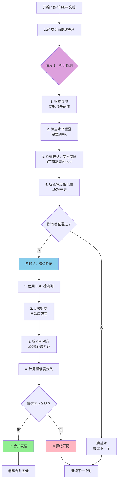
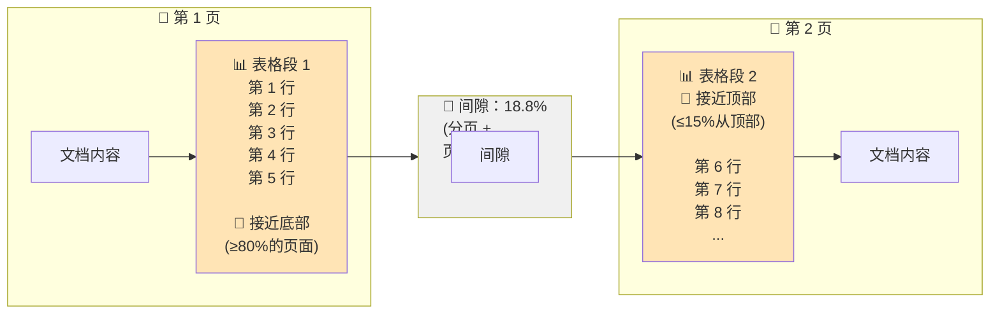
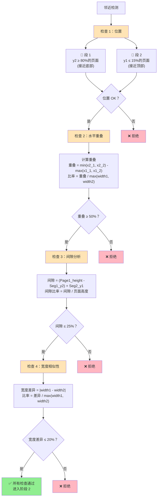
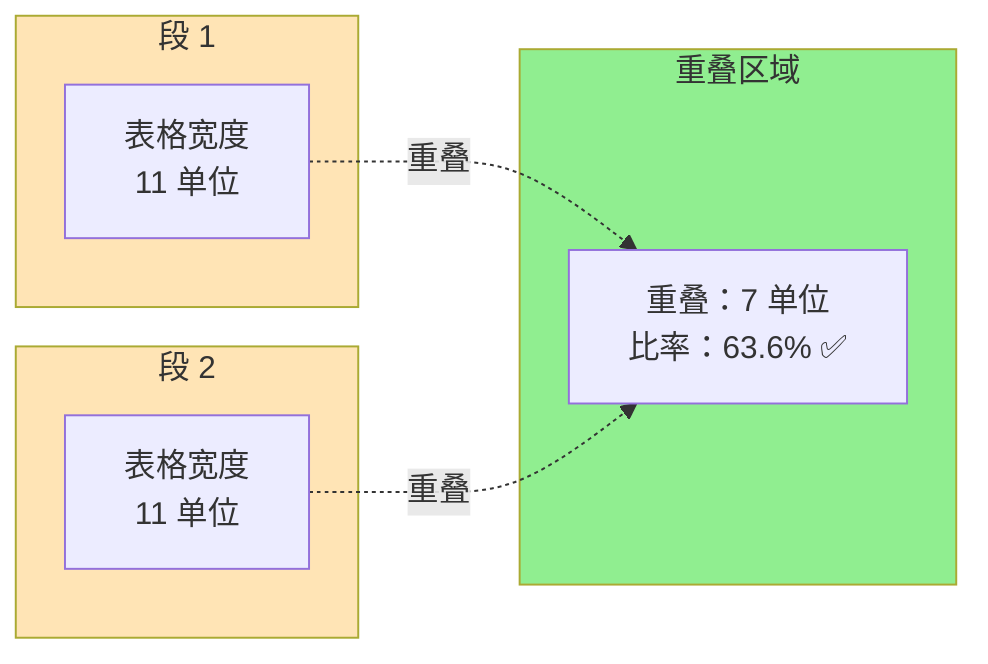
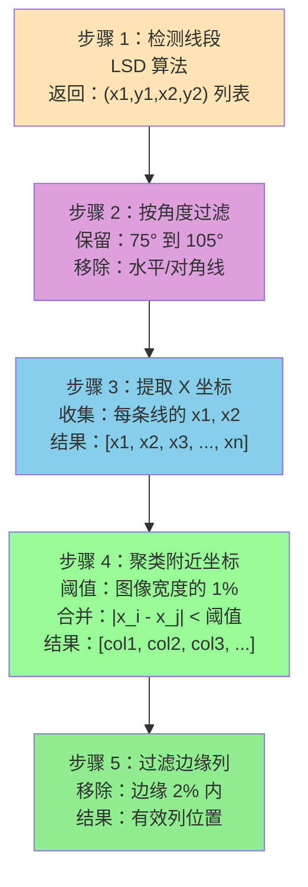
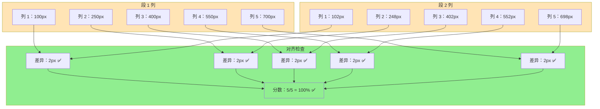

# 分割表格合并

Doctra 自动检测和合并跨页面边界分割的表格的综合指南。

## 概述

许多文档包含跨多个页面的大型表格。处理此类文档时，每个页面可能只包含表格的一部分，这使得提取完整数据变得困难。Doctra 的分割表格合并功能自动检测这些分割的表格并将它们合并为单个完整的表格图像。

## 目录

- [工作原理](#工作原理)
- [流程概述：逐步叙述](#流程概述逐步叙述)
- [检测算法](#检测算法)
- [可视化架构](#可视化架构)
- [分阶段详细说明](#分阶段详细说明)
- [配置参数](#配置参数)
- [示例](#示例)
- [故障排除](#故障排除)

## 工作原理 {#工作原理}

分割表格检测使用复杂的两阶段方法：

1. **阶段 1：邻近检测** - 快速空间启发式方法识别候选对
2. **阶段 2：结构验证** - 使用计算机视觉进行深度结构分析

这种设计在速度（避免对所有对进行昂贵操作）和准确性（仅验证有希望的候选）之间取得平衡。

## 流程概述：逐步叙述 {#流程概述逐步叙述}

为了帮助您理解分割表格合并的工作原理，以下是 Doctra 处理包含分割表格的文档时发生的情况：

### 初始情况

假设您有一个财务报告，其中包含一个跨两页的大型表格。在第 1 页，表格从第 1 行开始，一直持续到第 15 行，但在接近底部时空间不足。在第 2 页，表格从第 16 行继续，并包含剩余数据。对于人类读者来说，这显然是一个连续的表格，但对于文档解析器来说，这些看起来是两个独立的表格图像。

### 阶段 1：查找潜在匹配（邻近检测）

当 Doctra 开始处理您的文档时，它首先识别每一页上的所有表格。假设它在 5 页中总共找到 8 个表格。现在，Doctra 不是对所有 64 个可能的对（8×8）执行昂贵的计算机视觉分析，而是使用智能启发式方法快速过滤潜在匹配。

**位置检查**：Doctra 查找位于页面边界的表格。第 1 页上非常接近底部（例如，距离底部在页面高度的 20% 以内）的表格是分割表格第一部分的强候选。同样，第 2 页上非常接近顶部（距离顶部在 15% 以内）的表格可能是延续。如果两个条件都满足，这对表格将进入下一个检查。

**重叠检查**：即使两个表格位于页面边界，它们也可能是完全不同的表格。Doctra 检查它们是否水平重叠。如果两个表格至少有 50% 的水平重叠，这表明它们是对齐的，可能是同一个表格。就像两个拼图块 - 如果它们完全不重叠，它们可能不属于一起。

**间隙分析**：页面有页眉、页脚和页边距，在内容之间创建间隙。Doctra 计算第一个表格结束和第二个表格开始之间的总间隙，考虑分页。如果这个间隙是合理的（通常在页面高度的 25% 以内），它表明表格被正常的分页分隔，而不是有意放置得很远。

**宽度检查**：最后，Doctra 验证两个表格段具有相似的宽度。第 1 页上 800 像素宽的表格不应该在第 2 页突然变成 500 像素宽 - 这将表明不同的表格结构。相似的宽度表明结构连续性。

如果所有四项检查都通过，Doctra 就找到了一个有希望的候选对，并继续进行更深入的分析。这种过滤至关重要 - 这意味着 Doctra 只将计算资源花费在可能匹配的对上，保持过程快速。

### 阶段 2：验证匹配（结构验证）

对于通过阶段 1 的对，Doctra 使用计算机视觉执行更详细的分析，以确认它们确实是同一表格的一部分。

**图像预处理**：在分析结构之前，Doctra 增强表格图像。它将它们转换为灰度，使用 CLAHE（对比度受限自适应直方图均衡化）改善对比度，转换为二进制（黑白），并应用形态学操作以连接断开的或虚线。这为准确的线条检测准备了图像。

**列检测**：使用 OpenCV 的线段检测器（LSD），Doctra 识别每个表格段中的所有垂直线。这些垂直线代表列边界。算法检测线段，过滤接近垂直的线（75° 到 105°），提取它们的 x 坐标，将附近的坐标聚类在一起（因为多个小线段可能代表一列），最后移除太靠近边缘的列（这些通常只是页面边框）。

**列比较**：现在 Doctra 比较两个段之间检测到的列。首先，它检查列数是否相似 - 如果一个段有 5 列而另一个有 8 列，它们可能是不同的表格。但是，Doctra 使用自适应容差 - 对于较大的表格（更多列），它允许稍微更多的变化，因为在复杂表格上列检测可能不太精确。

**对齐验证**：即使列数匹配，列也需要在段之间对齐。Doctra 将段 1 中的每一列与段 2 中最接近的列配对，并测量距离。如果至少 60% 的列在小的容差内对齐（默认 10 像素），它表明相同的表格结构在页面之间继续。

**置信度评分**：基于所有这些因素，Doctra 计算 0 到 1 之间的置信度分数：
- 列数匹配贡献最多 0.3 分
- 列对齐贡献最多 0.4 分
- 宽度相似性贡献最多 0.1 分
- 水平重叠贡献最多 0.2 分

如果最终置信度分数满足最小阈值（默认 0.65），Doctra 确认这是一个分割表格并继续合并。

### 合并过程

一旦确认匹配，Doctra 通过垂直堆叠两个表格段创建合成图像。合并的图像然后在处理管道的其余部分被视为单个表格。如果您启用了 VLM（视觉语言模型），Doctra 从完整的合并表格中提取结构化数据，而不是从碎片中提取。

### 回退机制

有时，表格没有清晰的列边界（无边框表格）或由于图像质量导致列检测失败。Doctra 有回退机制：
- 如果检测到太多列（可能是噪声），它回退到基于邻近的匹配，置信度较低
- 如果在任一段中未检测到列，它仅依赖阶段 1 检查，置信度中等

这确保了即使没有清晰边框的表格，如果它们满足邻近标准，也可以合并。

### 最终结果

在您的财务报告示例中，Doctra 会检测到第 1 页（第 1-15 行）和第 2 页（第 16 行+）上的表格是同一表格的一部分。它会将它们合并为包含所有行的单个图像，这个完整的表格将作为一个连续表格而不是两个片段出现在您的输出 markdown、HTML 或 Excel 文件中。合并的表格标有页面范围（例如，"pages 1-2"）并包括置信度分数，以便您可以验证合并的质量。

这种两阶段方法确保 Doctra 可以准确合并分割表格，同时保持足够高效以用于生产，在合理的时间内处理包含许多表格的大型文档。

## 检测算法 {#检测算法}

### 高级流程



## 可视化架构 {#可视化架构}

### 文档布局表示



### 阶段 1：邻近检测架构



### 阶段 2：结构验证架构

```mermaid
flowchart TD
    Start[结构验证] --> Preprocess[步骤 1：图像预处理]
    
    Preprocess --> P1[RGB 图像]
    P1 --> P2[灰度转换]
    P2 --> P3[CLAHE 增强]
    P3 --> P4[OTSU 阈值化]
    P4 --> P5[形态学操作]
    P5 --> P6["增强的二进制图像<br/>准备用于 LSD"]
    
    P6 --> LSD[步骤 2：LSD 列检测]
    
    LSD --> LSD1["段 1<br/>检测垂直线"]
    LSD --> LSD2["段 2<br/>检测垂直线"]
    
    LSD1 --> Col1["检测到的列<br/>位置：100, 250, 400, 550, 700<br/>数量：5"]
    LSD2 --> Col2["检测到的列<br/>位置：102, 248, 402, 552, 698<br/>数量：5"]
    
    Col1 --> Compare[步骤 3：列比较]
    Col2 --> Compare
    
    Compare --> CountCheck{"列数<br/>差异在阈值内？"}
    CountCheck -->|是| AlignCheck["计算对齐<br/>检查位置差异"]
    CountCheck -->|否| Reject1["拒绝：数量不匹配"]
    
    AlignCheck --> AlignResult["对齐分数<br/>对齐的列 / 总列数<br/>示例：5/5 = 100%"]
    AlignResult --> AlignCheck2{"对齐 >= 60%？"}
    
    AlignCheck2 -->|是| ConfCalc[步骤 4：置信度计算]
    AlignCheck2 -->|否| Reject2["拒绝：对齐不良"]
    
    ConfCalc --> ConfFactors["分数因素<br/>列匹配：+0.3<br/>对齐：+0.4<br/>宽度相似性：+0.1<br/>重叠：+0.2"]
    ConfFactors --> ConfScore{"置信度 >= 0.65？}
    
    ConfScore -->|是| Merge["合并表格<br/>置信度：1.0"]
    ConfScore -->|否| Reject3["拒绝：置信度低"]
    
    style Merge fill:#90EE90
    style Reject1 fill:#FFB6C1
    style Reject2 fill:#FFB6C1
    style Reject3 fill:#FFB6C1
    style Preprocess fill:#87CEEB
    style LSD fill:#DDA0DD
```

## 分阶段详细说明 {#分阶段详细说明}

### 阶段 1：邻近检测

#### 1.1 位置检查

**目的**：识别位于页面边界的表格，这是分页的强指标。

**算法**：
```
对于第 N 页上的表格段 1：
  bottom_ratio = segment_y2 / page_height
  如果 bottom_ratio >= (1.0 - bottom_threshold_ratio)：
    ✅ 第一段的候选

对于第 N+1 页上的表格段 2：
  top_ratio = segment_y1 / page_height
  如果 top_ratio <= top_threshold_ratio：
    ✅ 第二段的候选
```

**示例**：
```
页面高度：1000px
段 1 y2：850px
  → bottom_ratio = 850/1000 = 0.85
  → 阈值：1.0 - 0.20 = 0.80
  → 0.85 >= 0.80 ✅ 通过

段 2 y1：150px
  → top_ratio = 150/1000 = 0.15
  → 阈值：0.15
  → 0.15 <= 0.15 ✅ 通过
```

#### 1.2 水平重叠检查

**目的**：确保表格水平对齐，表明它们是同一个表格。

**算法**：
```
overlap = calculate_overlap(seg1_x1, seg1_x2, seg2_x1, seg2_x2)
  = max(0, min(seg1_x2, seg2_x2) - max(seg1_x1, seg2_x1))

overlap_ratio = overlap / max(seg1_width, seg2_width)

如果 overlap_ratio >= 0.5：
  ✅ 通过（至少 50% 重叠）
```

**可视化表示**：



#### 1.3 间隙分析

**目的**：测量表格之间的空间，考虑分页、页眉和页脚。

**算法**：
```
gap_pixels = (page1_height - seg1_y2) + seg2_y1
gap_ratio = gap_pixels / page1_height

如果 gap_ratio <= max_gap_ratio：
  ✅ 通过（间隙合理）
```

**考虑因素**：
- 页眉/页脚占用空间
- 页边距创建自然间隙
- 默认 25% 适应典型的文档布局

#### 1.4 宽度相似性检查

**目的**：验证两个段具有相似的宽度，确认它们共享相同的结构。

**算法**：
```
width1 = seg1_x2 - seg1_x1
width2 = seg2_x2 - seg2_x1
width_diff = abs(width1 - width2)
width_ratio = width_diff / max(width1, width2)

如果 width_ratio <= width_similarity_threshold (0.20)：
  ✅ 通过（宽度相似）
```

### 阶段 2：结构验证

#### 2.1 图像预处理

**目的**：增强图像以获得最佳线条检测。

**步骤**：

1. **灰度转换**
   ```
   原始 RGB → 灰度
   ```

2. **对比度增强（CLAHE）**
   ```
   应用对比度受限自适应直方图均衡化
   → 改善低对比度区域的线条可见性
   ```

3. **二进制阈值化（OTSU）**
   ```
   灰度 → 二进制（黑白）
   → OTSU 自动确定最佳阈值
   ```

4. **形态学操作**
   ```
   应用 MORPH_CLOSE 与垂直核（1x5）
   → 连接断开的或虚线
   → 增强垂直线检测
   ```

**可视化流程**：


#### 2.2 LSD 列检测

**目的**：使用 OpenCV 的线段检测器检测代表列边界的垂直线。

**LSD 算法概述**：
```
1. 梯度计算
   → 计算图像梯度
   → 识别边缘区域

2. 线条区域增长
   → 从种子点增长线段
   → 连接具有相似方向的相邻像素

3. 区域验证
   → 验证区域满足线条标准
   → 按长度和支持过滤

4. 细化
   → 细化线条端点
   → 调整以获得亚像素精度
```

**列提取过程**：



**聚类示例**：
```
检测到的 x 坐标：
[98, 100, 102, 248, 250, 252, 398, 400, 402]

聚类后（阈值=5px）：
[100, 250, 400]  ← 检测到 3 列
```

#### 2.3 列数匹配

**目的**：使用自适应容差比较两个段中的列数。

**算法**：
```
col_count1 = len(columns_detected_in_seg1)
col_count2 = len(columns_detected_in_seg2)
diff = abs(col_count1 - col_count2)

# 基于表格大小的自适应阈值
max_cols = max(col_count1, col_count2)

如果 max_cols <= 5：
    max_allowed_diff = 1
否则如果 max_cols <= 10：
    max_allowed_diff = 2
否则如果 max_cols <= 20：
    max_allowed_diff = max(3, int(max_cols * 0.15))
否则：
    max_allowed_diff = max(5, int(max_cols * 0.20))

如果 diff <= max_allowed_diff：
    ✅ 通过
```

**示例**：
```
小表格：4 vs 5 列 → diff=1 → ✅ (阈值=1)
中等：8 vs 10 → diff=2 → ✅ (阈值=2)
大型：15 vs 18 → diff=3 → ✅ (阈值=3, 15*0.15=2.25→3)
```

#### 2.4 列对齐验证

**目的**：验证列在段之间对齐，确保结构连续性。

**算法**：
```
对于段 1 中的每一列：
    在段 2 中查找最接近的列
    计算距离 = |col1_pos - col2_pos|
    如果距离 <= 容差：
        ✅ 对齐的列
    否则：
        ❌ 未对齐的列

alignment_score = aligned_columns / total_columns

如果 alignment_score >= 0.6：
    ✅ 通过（至少 60% 对齐）
```

**可视化示例**：



#### 2.5 置信度计算

**目的**：计算合并决策的整体置信度分数。

**评分公式**：
```
confidence = 0.0

# 列数匹配（最多 0.3）
如果 column_count_match：
    confidence += 0.3
否则如果 column_diff <= 1：
    confidence += 0.2
否则如果 column_diff <= 2：
    confidence += 0.1

# 列对齐（最多 0.4）
alignment_weight = alignment_score * 0.4
confidence += alignment_weight

# 宽度相似性（最多 0.1）
width_score = 1.0 - min(1.0, width_ratio / 0.2)
confidence += width_score * 0.1

# 重叠比率（最多 0.2）
overlap_score = min(1.0, (overlap_ratio - 0.5) / 0.5)  # 0.5-1.0 → 0.0-1.0
confidence += overlap_score * 0.2

最终：confidence (0.0 - 1.0)
```

**示例计算**：
```
完美匹配：
  - 列数：5 vs 5 → +0.3
  - 对齐：100% → +0.4
  - 宽度：800px vs 802px (0.25%) → +0.1
  - 重叠：98% → +0.2
  总计：1.0（100% 置信度）✅
```

### 回退机制

#### 检测到太多列

**问题**：LSD 可能将噪声（水平线、文本边界）检测为列。

**解决方案**：
```
如果 detected_columns > 20：
    → 可能是噪声，不是真实列
    → 跳过结构验证
    → 使用基于邻近的回退
    → 置信度：0.70（低于验证的）
```

#### 未检测到列

**问题**：无边框表格或图像质量差导致列检测失败。

**解决方案**：
```
如果两个段中 columns_detected == 0：
    → 表格缺乏可见边框
    → 回退到邻近匹配
    → 置信度：0.65
    → 原因："邻近匹配（LSD 未检测到列）"
```

## 配置参数 {#配置参数}

### 详细参数参考

| 参数 | 类型 | 默认值 | 范围 | 影响 |
|------|------|--------|------|------|
| `merge_split_tables` | bool | `False` | True/False | 功能的主开关 |
| `bottom_threshold_ratio` | float | `0.20` | 0.0-1.0 | 距离底部多近触发检测 |
| `top_threshold_ratio` | float | `0.15` | 0.0-1.0 | 距离顶部多近触发检测 |
| `max_gap_ratio` | float | `0.25` | 0.0-1.0 | 段之间的最大间隙 |
| `column_alignment_tolerance` | float | `10.0` | 1.0-50.0 | 对齐的像素容差 |
| `min_merge_confidence` | float | `0.65` | 0.0-1.0 | 合并的最小置信度 |

### 调优指南

#### 对于具有大页眉/页脚的文档

```python
parser = StructuredPDFParser(
    merge_split_tables=True,
    max_gap_ratio=0.30,  # 对于更大的页眉增加到 30%
)
```

#### 对于更严格的合并（更少的误报）

```python
parser = StructuredPDFParser(
    merge_split_tables=True,
    min_merge_confidence=0.80,  # 更高的阈值
    column_alignment_tolerance=5.0,  # 更严格的对齐
)
```

#### 对于更积极的合并（捕获更多情况）

```python
parser = StructuredPDFParser(
    merge_split_tables=True,
    min_merge_confidence=0.55,  # 更低的阈值
    max_gap_ratio=0.35,  # 允许更大的间隙
    bottom_threshold_ratio=0.25,  # 更宽松的位置检查
    top_threshold_ratio=0.20,
)
```

## 示例 {#示例}

### 示例 1：财务报告表格

```
文档：季度财务报告
页面：2 页，表格跨两页

检测结果：
✅ 找到匹配：第 1 页→第 2 页
   置信度：0.92
   原因：LSD 验证：6 vs 6 列，对齐=0.95
   间隙：页面高度的 18.8%
   
输出：
- 合并图像：merged_table_1_2.png
- Markdown：单个表格条目，注释 "pages 1-2"
```

### 示例 2：无边框表格

```
文档：研究数据表格
页面：2 页，无可见边框

检测结果：
✅ 找到匹配：第 3 页→第 4 页
   置信度：0.70
   原因：邻近匹配（检测到太多列，可能是噪声）
   注意：使用回退验证（无清晰的列边界）
   
输出：
- 创建合并图像
- 由于缺乏结构验证，置信度较低
```

### 示例 3：拒绝的匹配

```
文档：独立表格
页面：2 页，包含不同的表格

检测结果：
❌ 无匹配
   原因：列数不匹配（4 vs 7 列）
   置信度：0.45（低于 0.65 的阈值）
   
输出：
- 表格单独处理
- 未尝试合并
```

## 故障排除 {#故障排除}

### 表格未合并

**问题**：分割表格未被检测到。

**解决方案**：

1. **检查位置阈值**
   ```python
   # 验证表格是否真的接近页面边界
   bottom_threshold_ratio=0.25  # 尝试增加
   top_threshold_ratio=0.20
   ```

2. **检查间隙容差**
   ```python
   # 大页眉/页脚可能需要：
   max_gap_ratio=0.30  # 从 0.25 增加
   ```

3. **降低置信度阈值**
   ```python
   min_merge_confidence=0.60  # 尝试从 0.65 降低
   ```

4. **启用调试模式**
   ```python
   import logging
   logging.basicConfig(level=logging.DEBUG)
   ```

### 误报（错误合并）

**问题**：独立表格被错误合并。

**解决方案**：

1. **增加置信度阈值**
   ```python
   min_merge_confidence=0.75  # 更保守
   ```

2. **收紧对齐容差**
   ```python
   column_alignment_tolerance=5.0  # 更严格的对齐
   ```

3. **调整位置阈值**
   ```python
   bottom_threshold_ratio=0.15  # 更严格
   top_threshold_ratio=0.10
   ```

### 性能问题

**问题**：使用分割表格检测时处理太慢。

**解决方案**：

1. **如果不需要则禁用**
   ```python
   merge_split_tables=False  # 完全跳过检测
   ```

2. **功能已经优化** - 阶段 1 在昂贵的阶段 2 操作之前过滤掉大多数对

### 列检测失败

**问题**：LSD 未正确检测列。

**原因和解决方案**：

1. **图像质量低**
   - 解决方案：增加 DPI
   ```python
   dpi=300  # 而不是 200
   ```

2. **虚线/断线**
   - 解决方案：已通过形态学操作处理
   - 可能需要检查预处理参数

3. **无边框表格**
   - 解决方案：系统自动回退到邻近匹配

## 技术实现细节

### 数据结构

```python
@dataclass
class TableSegment:
    """表示带有边界框和页面信息的表格段。"""
    page_index: int
    box_index: int
    x1: float
    y1: float
    x2: float
    y2: float
    page_width: int
    page_height: int
    image: Image.Image  # 裁剪的表格图像
    confidence: float

@dataclass
class SplitTableMatch:
    """表示已验证的分割表格匹配。"""
    segment1: TableSegment
    segment2: TableSegment
    confidence: float
    merge_reason: str
    column_count1: int
    column_count2: int
```

### 性能特征

- **时间复杂度**：O(n²) 对于表格对，但阶段 1 过滤显著减少 n
- **空间复杂度**：O(n) 用于存储段和匹配
- **典型性能**：
  - 10 页，20 个表格 → 阶段 1 约 10ms，阶段 2 约 50ms
  - 大部分时间花费在图像处理（LSD 检测）上

### 依赖项

- **OpenCV**：用于 LSD（线段检测器）和图像处理
- **NumPy**：用于数值操作
- **PIL**：用于图像操作

## 最佳实践

1. **为财务/结构化文档启用**：最可能有分割表格
2. **为叙述性文档禁用**：表格通常是独立的
3. **根据文档类型调整阈值**：财务报告可能需要与学术论文不同的设置
4. **审查合并结果**：特别是在使用较低置信度阈值时
5. **使用适当的 DPI**：更高的 DPI 提高列检测准确性

## 相关文档

- [结构化解析器指南](../parsers/structured-parser.md) - 主要解析器文档
- [API 参考](../../api/parsers.md) - 完整参数参考
- [示例](../../examples/basic-usage.md) - 代码示例和用例

